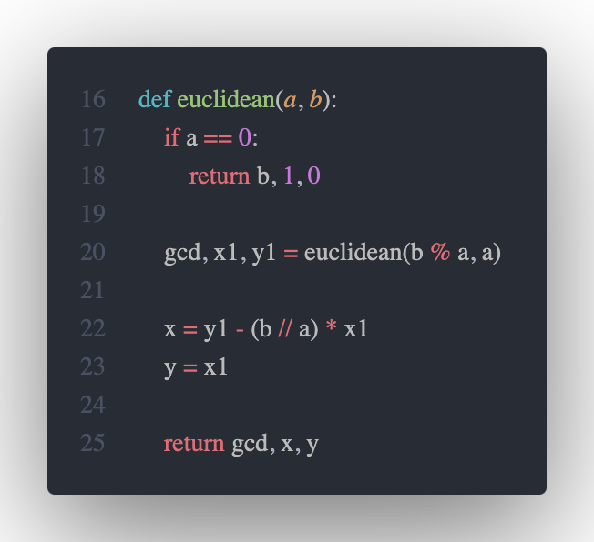
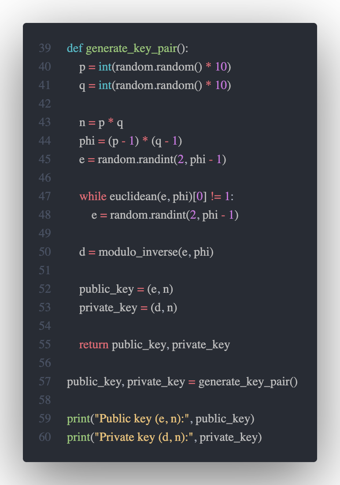

# RSA Encryption
RSA uses a pair of public and private keys. The public key is used for encryption, while the private key is used for decryption. This allows a sender to encrypt data using the recipient's public key, and only the recipient, who possesses the corresponding private key, can decrypt and access the original data.

File `generate_keys.py` generate mentioned above keys in separate files `public.key` and `private.key`.

The `extended Euclidean algorithm` becomes especially valuable when `a` and `b` are coprime, meaning their greatest common divisor (gcd) is 1. In this context, x represents the modular multiplicative inverse of "a modulo b," and y is the modular multiplicative inverse of "b modulo a." Notably, calculating the modular multiplicative inverse is a crucial step in the RSA public-key encryption method.

The "generate_key_pair" function then randomly selects prime numbers, `p` and `q`, and computes `n` from them. It determines Euler's totient function, indicating the count of numbers that are coprime with `ϕ=(p − 1) × (q − 1)`.
The function proceeds to randomly select a number, e, and computes d, which is the modular inverse of `e modulo ϕ`.

